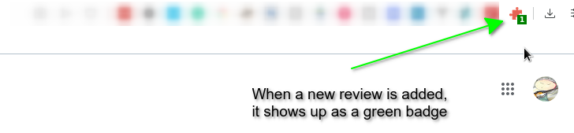
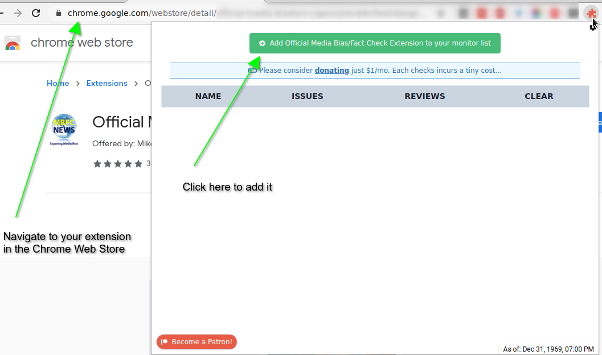
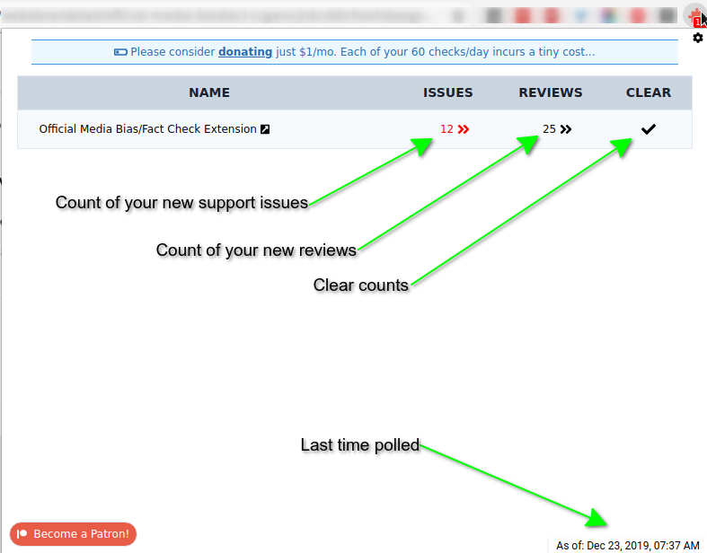
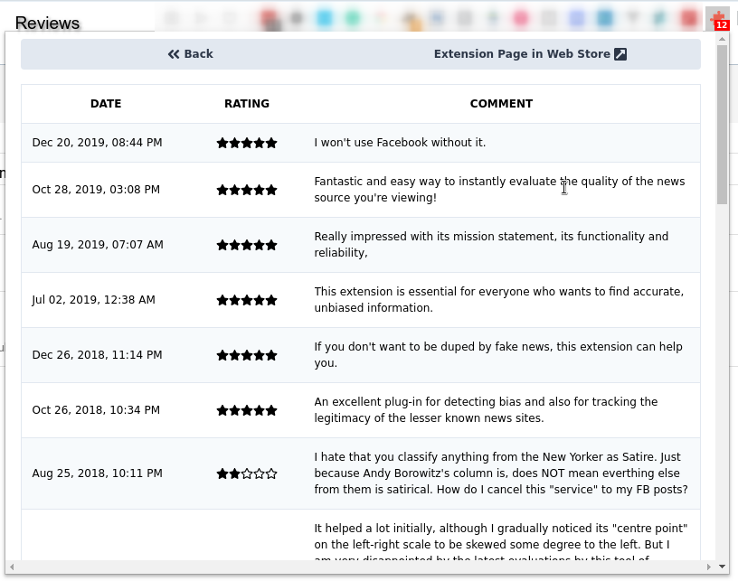
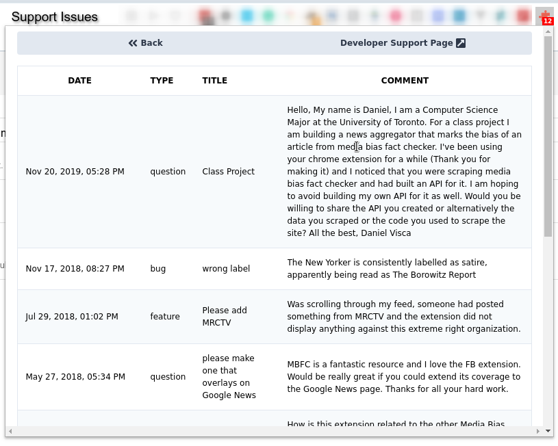
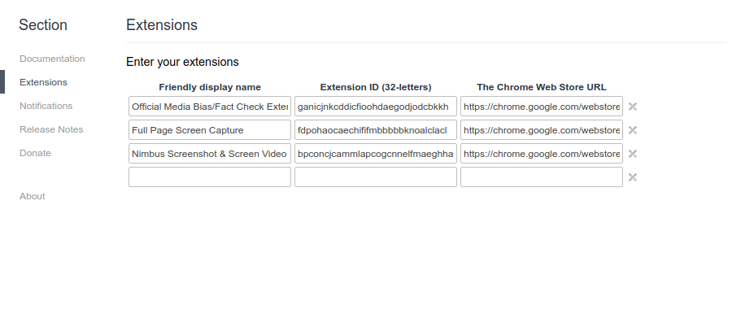
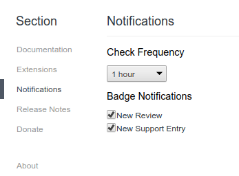

## Chrome Extension Monitor

This project is made up of 2 parts:

- chrome-extension-monitor -- The source code for the Chrome Extension
- monitor-cors-proxy -- The [Firebase](https://firebase.google.com/) function that reads the information from the Chrome Web Store

## Screenshots

### Extension Badges

### Add via your Chrome Web Store page

### Summary of each extension

### View Reviews

### View Support Requests

### Options

